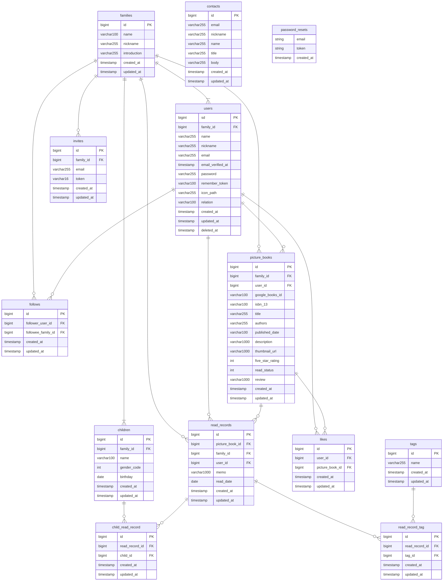

```mermaid
erDiagram
	families ||--|{ users : ""
	families ||--|{ children : ""
	families ||--o{ follows : ""
	families ||--o{ picture_books : ""
	families ||--o{ read_records : ""
	families ||--o{ invites : ""
	users ||--o{ follows : ""
	users ||--o{ likes : ""
	users ||--o{ picture_books : ""
	users ||--o{ read_records : ""
	children ||--o{ child_read_record : ""
	picture_books ||--o{ read_records : ""
	picture_books ||--o{ likes : ""
	read_records ||--o{ child_read_record : ""
	read_records ||--o{ read_record_tag : ""
	tags ||--o{ read_record_tag : ""
	families {
	  bigint id PK
	  varchar100 name
	  varchar255 nickname
	  varchar255 introduction
	  timestamp created_at
	  timestamp updated_at
	}
    	users {
	  bigint sd PK
	  bigint family_id FK
	  varchar255 name
	  varchar255 nickname
	  varchar255 email
	  timestamp email_verified_at
	  varchar255 password
	  varchar100 remember_token
	  varchar255 icon_path
	  varchar100 relation
	  timestamp created_at
	  timestamp updated_at
	  timestamp deleted_at
	}
	children {
	  bigint id PK
	  bigint family_id FK
	  varchar100 name
	  int gender_code
		date birthday
	  timestamp created_at
	  timestamp updated_at
	}	
	picture_books {
	  bigint id PK
	  bigint family_id FK
	  bigint user_id FK
	  varchar100 google_books_id
	  varchar100 isbn_13
	  varchar255 title
	  varchar255 authors
	  varchar100 published_date
	  varchar1000 description
	  varchar1000 thumbnail_url
	  int five_star_rating
	  int read_status
	  varchar1000 review
	  timestamp created_at
	  timestamp updated_at
	}
	read_records {
	  bigint id PK
	  bigint picture_book_id FK
	  bigint family_id FK
	  bigint user_id FK
	  varchar1000 memo
	  date read_date
	  timestamp created_at
	  timestamp updated_at
	}
	child_read_record {
	  bigint id PK
	  bigint read_record_id FK
	  bigint child_id FK
	  timestamp created_at
	  timestamp updated_at
	}
	tags {
	  bigint id PK
	  varchar255 name
	  timestamp created_at
	  timestamp updated_at
	}
	read_record_tag {
	  bigint id PK
	  bigint read_record_id FK
	  bigint tag_id FK
	  timestamp created_at
	  timestamp updated_at
	}
	follows {
	  bigint id PK
	  bigint follower_user_id FK
	  bigint followee_family_id FK
	  timestamp created_at
	  timestamp updated_at
	}
	likes {
	  bigint id PK
	  bigint user_id FK
	  bigint picture_book_id FK
	  timestamp created_at
	  timestamp updated_at
	}
	invites {
	  bigint id PK
	  bigint family_id FK
	  varchar255 email
	  varchar16 token
	  timestamp created_at
	  timestamp updated_at
	}
	contacts {
	  bigint id PK
	  varchar255 email
	  varchar255 nickname
	  varchar255 name
	  varchar255 title
	  varchar255 body
	  timestamp created_at
	  timestamp updated_at
	}

	password_resets {
	  string email
	  string token
	  timestamp created_at
	}
``` 
